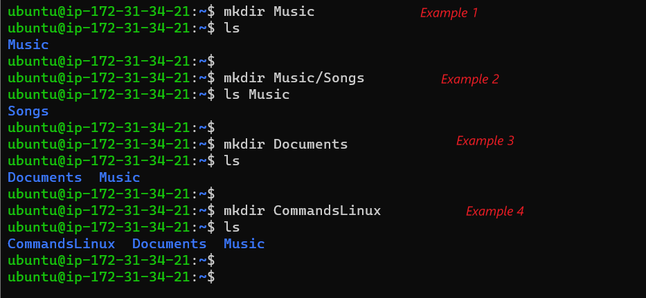
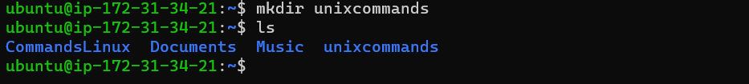

## 8. mkdir command:

Use the mkdir command to create one or multiple directories at once and set permissions for each of them. The user executing this command must have the privilege to make a new folder in the parent directory, or they may receive a permission denied error. Also note that Linux commands are case-sensitive (A is NOT a).

Here’s the basic syntax:

```markdown
mkdir [option] directory_name
```
For example, you want to create a directory called Music:

1. ```mkdir Music```

To make a new directory called Songs inside Music:

2. ```mkdir Music/Songs```

To create a directory called documents:

3. ```mkdir Documents```

To create a directory called CommandsLinux:

4. ```mkdir CommandsLinux```




To create a directory called unixcommands:

5. ```mkdir unixcommands```



The mkdir command accepts many options, such as:

-p or –parents create a directory between two existing folders. For example, mkdir -p Music/2020/Songs will make the new “2020” directory. -m sets the file permissions. For instance, to create a directory with full read, write, and execute permissions for all users, enter mkdir -m777 directory_name. -v prints a message for each created directory.
